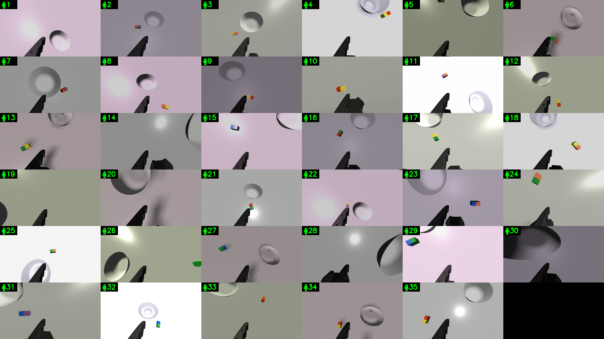
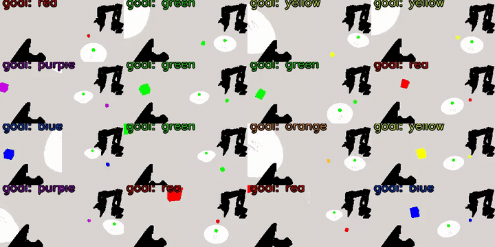
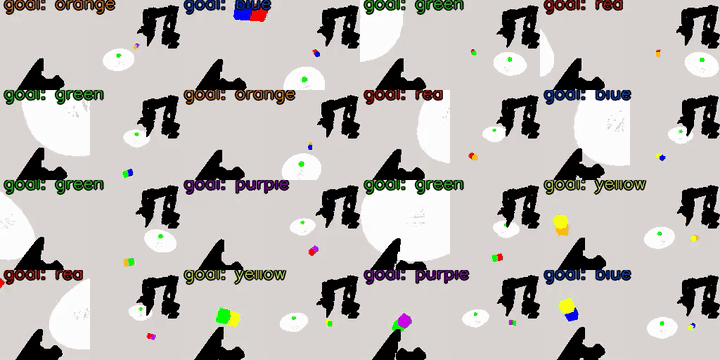
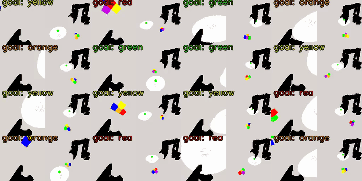
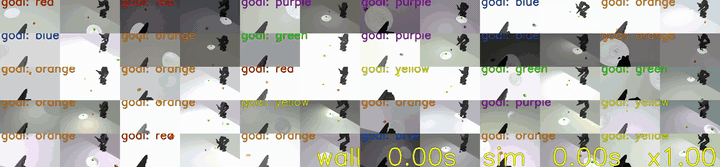
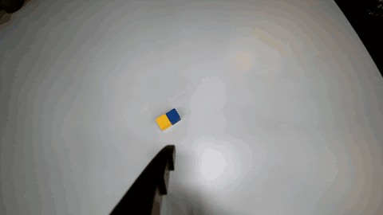
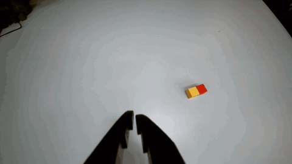

# Vision-RL Pick-and-Place on the SO-101 Arm — ETH Robot Learning

A sim-to-real visual reinforcement learning pipeline that picks colour-queried cubes and drops them in a bowl using an **SO-101** robot arm and a single wrist camera. Built for the **ETH Zürich Robot Learning** course (Spring 2026), implementing the three official course evaluations end-to-end on the physical robot. The repo started from [Squint (Almuzairee & Christensen, 2026)](https://arxiv.org/abs/2602.21203) but at this point essentially every layer of the stack — training environment, reward, observation pipeline, deploy logic, and the eval orchestrators — has been rewritten or extended for this project.

<p align="center">
  
  <br/>
  <em>35 randomized training environments seen from the wrist camera. Lighting, cube colours/positions, bowl pose, and shadows are all sampled per episode — this is what the policy sees during training.</em>
</p>

---

## What it does

The robot has to pick up the cube of a queried colour and drop it into a bowl. Three increasingly hard scene configurations are evaluated on the **real SO-101 arm** (not just in sim):

| Eval | Scene | Policy stack | Doc |
|---|---|---|---|
| **Eval 1** | 1 cube + bowl | Pick policy → FK/IK place | [`final_utils/EVAL1.md`](final_utils/EVAL1.md) |
| **Eval 2** | 2 cubes (may be touching) + bowl | **Split policy** to separate cubes → Pick policy → FK/IK place | [`final_utils/EVAL2.md`](final_utils/EVAL2.md) |
| **Eval 3** | 4 cubes + bowl, **3 colours queried in order** | 4-cube split → loop {Pick → place} per colour | [`final_utils/EVAL3.md`](final_utils/EVAL3.md) |

Every eval is a single command with a deterministic exit code (`0` = success, `1` = fail) so the whole pipeline scripts cleanly.

```bash
python -m final_utils.pick_place --goal_color 0 --bowl_xy 0.25 0.20            # Eval 1
python -m final_utils.eval2      --goal_color 0 --bowl_xy 0.25 0.20            # Eval 2
python -m final_utils.eval3      --goal_colors 0 2 4 --bowl_xy 0.25 0.20       # Eval 3
```

Each command auto-loads the bundled checkpoints (`final_utils/pick_place_policy.pt`, `split_policy.pt`, `split4_policy.pt`) and the on-disk calibration JSONs.

---

## Demos

### Stage 1 — first sim-successful policies on an un-realistic env

The very first set of policies we trained — one per eval — already **solved each task in simulation**. Reward shaping, curriculum, and SAC were all in place. The environment, however, was a stylised ManiSkill3 default: flat shading, uniform table, generic colours, no shadow occluder on the wrist camera.

<p align="center">
  
  
  
  <br/>
  <em>Left → right: the early sim-only successful runs for Eval 1 (single cube), Eval 2 (split + pick), Eval 3 (4 cubes, ordered colour pick). All three finish the task in simulation. MP4 versions in <a href="docs/media/">docs/media/</a>.</em>
</p>

**These policies did not transfer to the real robot.** Despite the in-sim success rate, the real SO-101 reach was inconsistent, grasps misfired, and the bowl placement was unreliable. The reward function was not the bottleneck.

### Stage 2 — realistic env, same algorithm → same policy now transfers

Without changing the SAC algorithm or the reward shaping, we **rebuilt the environment for realism**: carton bowl, plastic table, wood cubes, PLA-textured robot, key/fill/point lighting with stronger shadow contrast, a 3 cm wrist-mounted shadow occluder to match the real camera's housing, and tighter domain randomization over all of it. The next training run looked like this:

<p align="center">
  
  <br/>
  <em>Mid-training snapshot of the realistic-env policy across several parallel envs. Lighting, cube colours, friction, and camera jitter are randomized per tile; the reach is already decisive, the SAC actor is still refining the grasp.</em>
</p>

That same policy — same code, same reward, just a realistic environment — drove the real SO-101 below:

### Stage 3 — real SO-101, Eval 2

<p align="center">
  
  
  <br/>
  <em>Eval 2 on the physical SO-101. Left: two cubes spawned touching, split policy nudges them apart, then the pick policy targets <b>blue</b> and drops it in the bowl. Right: same scene, goal colour <b>yellow</b>. MP4 versions in <a href="docs/media/">docs/media/</a>.</em>
</p>

**Takeaway.** Environment realism turned out to be **as important as reward shaping** for closing the sim-to-real gap. Sim success is necessary but not sufficient; matching the real camera's view distribution — materials, shadows, light envelope, lens parameters — is what actually transfers.

---

## What changed vs upstream Squint

Squint provided the SAC backbone and an initial SO-101 ManiSkill3 environment with a single-cube reach/lift/place task family. From that starting point this project added:

- **Three custom evaluation orchestrators** ([`final_utils/eval2.py`](final_utils/eval2.py), [`eval3.py`](final_utils/eval3.py), [`pick_place.py`](final_utils/pick_place.py)) — a hybrid policy / FK-IK / state-machine controller. The RL policy handles approach; the grasp / carry / release is a deterministic hardcoded layer. The split phase is timed off the FK tip height, with hard caps and retry logic per colour.
- **A dedicated cube-separation ("split") policy and curriculum** ([`envs/place.py`](envs/place.py), [`scripts/brev_run_split.sh`](scripts/brev_run_split.sh)) — separate-progress reward, table-touch & bowl-touch penalties, plus a closest-first 4-cube variant for Eval 3. Two bundled checkpoints (`split_policy.pt`, `split4_policy.pt`).
- **A FastSAM-based segmentation mask** ([`final_utils/fastsam_seg.py`](final_utils/fastsam_seg.py), [`final_utils/calib_cube_colors_live.py`](final_utils/calib_cube_colors_live.py)) — at deploy time, kept-mask = gripper ∪ goal-coloured cube; distractors are greyed out, the bowl is greyed, the background is replaced with a black overlay so the policy sees the same input distribution as in sim.
- **Calibration tooling**: table-height-vs-reach surface ([`examples/table_z_calib.py`](examples/table_z_calib.py)), RGB-chromaticity-based per-cube colour calibration ([`final_utils/calib_cube_colors_live.py`](final_utils/calib_cube_colors_live.py)), live bowl-pose teaching ([`final_utils/teach_bowl_xy.py`](final_utils/teach_bowl_xy.py)), hand-eye extrinsics ([`final_utils/calib_extrinsics.py`](final_utils/calib_extrinsics.py)), bowl ellipse mask ([`final_utils/tune_bowl_mask.py`](final_utils/tune_bowl_mask.py)).
- **Realistic-materials env** — carton bowl, plastic table, wood cubes, PLA robot, key/fill/point lights with stronger shadow contrast and a wrist-mounted shadow occluder.
- **Aggressive domain randomization**: per-episode wrist-cam pose jitter (±3 mm / ±2°), item friction & mass, table friction, lighting envelope, torchvision colour jitter — the 35-tile hero image at the top is the same DR distribution the policy trains under.
- **Reward changes for the pick task**: pick-only reward shaping (`pick_only_reward`), drop penalty (`DROP_PENALTY_COEF`), side-approach curriculum, configurable `eval_max_episode_steps` budget — see [`notes/baseline_eval1_pick_80x144.md`](notes/baseline_eval1_pick_80x144.md) and [`notes/pick_only_reward.md`](notes/pick_only_reward.md).
- **RLPD synthetic-demos pipeline** for warm-starting from IK-generated grasp trajectories ([`docs/RLPD_DEMO_PIPELINE.md`](docs/RLPD_DEMO_PIPELINE.md), [`src/demo_loader.py`](src/demo_loader.py), [`scripts/make_synthetic_demos.py`](scripts/make_synthetic_demos.py), [`scripts/collect_rlpd_demos.py`](scripts/collect_rlpd_demos.py)).
- **Sim chaining evaluator** ([`scripts/eval_pipeline_sim.py`](scripts/eval_pipeline_sim.py)) — runs the full Eval 1/2/3 stack inside ManiSkill3 with a soft-reset between cube picks and a per-cube success checker, useful to triage checkpoints before going to the real arm.
- **Brev / RTX Pro 6000 training infrastructure** ([`scripts/brev_*.sh`](scripts/)) — one-line bootstrap from `curl` to a configured VM running training in tmux, with Blackwell-specific torch swap and `expandable_segments` memory tuning that fixes a real fragmentation OOM at 80×144 + jitter.

What's still recognisably Squint: the SAC algorithm + C51 critic in [`src/train_squint.py`](src/train_squint.py), the encoder shape, the LeRobot / ManiSkill3 plumbing in [`envs/base_random_env.py`](envs/base_random_env.py), and the broad black-background overlay strategy in [`envs/black_overlay.png`](envs/black_overlay.png).

---

## Repo layout

```
RL_LeRobot_pickandplace/
├── README.md                 ← you are here
├── LICENSE                   ← MIT (original Squint copyright preserved)
├── environment.yaml          ← conda env spec
├── setup_env.sh              ← one-shot env bootstrap
│
├── src/                      ← training + sim entry points
│   ├── train_squint.py        - SAC + C51 trainer entry
│   ├── utils.py               - training utils (encoder, replay, logging)
│   ├── sim_eval_log.py        - sim-only eval driver
│   ├── demo_loader.py         - v2 HDF5 → TensorDict for RLPD warm-starts
│   ├── run_policy_sim.py      - headless single-episode sim check
│   └── play_policy.py         - interactive sim viewer
│
├── envs/                     ← custom ManiSkill3 envs for SO-101
│   ├── base_random_env.py     - shared DR + masking + overlay
│   ├── place.py               - PlaceCube + split task + 4-cube variant
│   ├── black_overlay.png      - background overlay used in DR
│   ├── meshes/                - cube/bowl/wrist-shadow geometry
│   └── robot/                 - SO-101 URDF + meshes
│
├── final_utils/              ← Eval 1/2/3 entry points + bundled policies
│   ├── EVAL1.md / EVAL2.md / EVAL3.md   - per-eval run docs
│   ├── pick_place.py          - Eval 1 driver
│   ├── eval2.py               - Eval 2 driver (split → pick)
│   ├── eval3.py               - Eval 3 driver (split → loop pick)
│   ├── pick_place_policy.pt   - bundled pick policy (~9 MB)
│   ├── split_policy.pt        - bundled 2-cube split policy
│   ├── split4_policy.pt       - bundled 4-cube split policy
│   ├── fastsam_seg.py         - FastSAM cube + gripper + bowl masking
│   ├── calib_cube_colors_live.py / calib_extrinsics.py / teach_bowl_xy.py / tune_bowl_mask.py
│   └── hf_record.py           - per-episode HF dataset uploader
│
├── deploy_utils/             ← SO-101 hardware + deploy entry points
│   ├── manipulator.py / robot_config.py / tune_camera.py - hardware interface
│   ├── deploy.py              - original-Squint single-policy real deploy (kept for parity)
│   ├── infer.py               - standalone macOS deploy mirror of pick_place.py
│   ├── infer_linux.py         - Linux deploy mirror (full single-cube pipeline)
│   ├── infer_eval2_linux.py   - Linux deploy mirror (split + pick + place)
│   ├── so101_fk.py            - forward kinematics for the SO-101 arm
│   ├── bowl_mask.py / cube_gripper_mask.py / cube_mask_rsebti.py - deploy-time masking utilities
│   └── blender_stls/          - cube + bowl STL files
│
├── calibration/              ← on-disk calibration data auto-loaded by the evals
│   ├── camera_intrinsics.json / camera_extrinsics_handeye.json
│   ├── table_z_calib.json / table_z_calib_raw.npz
│   ├── hue_calib.json / cube_color_calib.json / bowl_mask_calib.json
│   ├── so101_follower_arm.json   - LeRobot motor calibration
│   └── gripper_mask.png           - baked gripper silhouette
│
├── scripts/                  ← training + RLPD + sim-eval launchers
│   ├── README_brev.md
│   ├── brev_bootstrap_rtx6000.sh   - one-line curl-to-running-training
│   ├── brev_setup.sh / brev_run_*.sh - per-recipe launchers
│   ├── brev_run_evals.sh           - 3-stage warm-start curriculum
│   ├── brev_run_split.sh           - split-task launcher
│   ├── eval_pipeline_sim.py        - sim-side Eval 1/2/3 chain
│   ├── eval_split_policy.py        - split-only sim eval
│   ├── make_synthetic_demos.py / collect_rlpd_demos.py / check_rlpd_demos_v2.py - RLPD demo pipeline
│   ├── gen_carton_bowl.py / mesh_bowl_from_ply.py - asset generation
│   └── calibrate_camera.py
│
├── docs/                     ← course-readable docs + media
│   ├── RLPD_DEMO_PIPELINE.md
│   └── media/                 - hero PNG + real-robot GIFs + env-preview tiles + MP4 originals
│
├── notes/                    ← experiment journals (baseline configs, ablation results)
│   ├── baseline_eval1_pick_80x144.md
│   ├── pick_only_reward.md
│   └── isaac_handoff_reply.md
│
├── examples/                 ← user-facing examples (kept lean)
│   ├── visualize_sim.py        - browse all envs interactively
│   └── table_z_calib.py        - one-time table-height calibration
│
└── archive/                  ← debug scripts, sweeps, working notes (not needed to use the repo)
```

---

## Quick start — running the evals

### 0. Environment

```bash
conda env create -f environment.yaml
conda activate squint              # env name kept from upstream Squint
# or:
bash setup_env.sh                  # one-shot bootstrap that also installs pinned linux libs
```

### 1. One-time calibration (per rig / per setup)

These write small JSON files at the repo root that the evals **auto-load**. Redo them when you move the camera, change the lighting, or change the table. Full instructions: [`final_utils/EVAL1.md`](final_utils/EVAL1.md).

```bash
# Table height vs reach (drag the fingertip across the table)
python examples/table_z_calib.py

# Per-cube RGB-chromaticity reference (one cube at a time)
python -m final_utils.calib_cube_colors_live --camera_index 1

# Bowl position in the FK base frame (gravity-comp the arm, place tip over bowl)
python -m final_utils.teach_bowl_xy

# (Eval 2/3 only) hand-eye extrinsics
python -m final_utils.calib_extrinsics
```

### 2. Run

```bash
# Eval 1 — single cube of the queried colour into the bowl
python -m final_utils.pick_place --goal_color 0 --bowl_xy 0.25 0.20 && echo "EVAL1 PASS"

# Eval 2 — two cubes (may be touching), pick the queried colour
python -m final_utils.eval2 --goal_color 0 --bowl_xy 0.25 0.20 && echo "EVAL2 PASS"

# Eval 3 — four cubes, pick the three queried colours in that exact order
python -m final_utils.eval3 --goal_colors 0 2 4 --bowl_xy 0.25 0.20 && echo "EVAL3 PASS"
```

Colour codes: `0 red · 1 blue · 2 green · 3 yellow · 4 purple · 5 orange`.

Each run buffers the last 20 s of camera + joint scalars into a Rerun `.rrd` file you can open with [rerun.io](https://rerun.io). Disable with `--no-save_window`.

---

## Training pipeline (sim)

Training was run on **Brev / NVIDIA RTX Pro 6000 (Blackwell, 96 GB)** VMs. Expected wall time for one stage is ~5–8 h.

### Reproduce the bundled `pick_place_policy.pt` from scratch

One line on a fresh VM with `WANDB_API_KEY` exported:

```bash
curl -fsSL https://raw.githubusercontent.com/fedecomi04/RL_LeRobot_pickandplace/master/scripts/brev_bootstrap_rtx6000.sh | \
  LAUNCHER=scripts/brev_run_ablation.sh \
  PICK_ONLY=true \
  N_DISTRACTORS=0 \
  SIM_FREQ=100 \
  LATENCY=off \
  EP_STEPS=100 \
  IMAGE_HEIGHT=80 IMAGE_WIDTH=144 \
  RENDER_HEIGHT=360 RENDER_WIDTH=640 \
  NUM_ENVS=1024 \
  BUFFER_SIZE=500000 \
  BATCH_SIZE=512 \
  TOTAL_TIMESTEPS=10000000 \
  EXP_NAME=eval1_pick_80x144 \
  bash
```

The full config table for this baseline is in [`notes/baseline_eval1_pick_80x144.md`](notes/baseline_eval1_pick_80x144.md). The rest of the launchers in [`scripts/`](scripts/) cover the split task ([`brev_run_split.sh`](scripts/brev_run_split.sh)), the 3-stage warm-start curriculum ([`brev_run_evals.sh`](scripts/brev_run_evals.sh)), and the smaller ablation grids.

### Local training

```bash
PYTHONPATH=. python src/train_squint.py --env_id=SO101PlaceCube-v1 --pick_only_reward --total_timesteps=10000000 --num_envs=1024
```

The trainer writes checkpoints to `runs/<exp_name>/ckpt.pt` and uploads to wandb under entity `fedecominelli04_robot`, project `maniskill-so101`.

---

## Hardware

- **Arm**: SO-101 follower from [WowRobo](https://shop.wowrobo.com/products/so-arm101-diy-kit-assembled-version-1), serial port `/dev/ttyACM0`.
- **Camera**: wrist-mounted USB camera at 1920×1080, downsampled to 80×144 (16:9) at inference time via `cv2.resize(INTER_AREA)`. Calibrated extrinsics in [`calibration/camera_extrinsics_handeye.json`](calibration/camera_extrinsics_handeye.json), intrinsics in [`calibration/camera_intrinsics.json`](calibration/camera_intrinsics.json).
- **3D-printed objects**: cube + bowl STL files in [`deploy_utils/`](deploy_utils/). Suggested PLA colours match the in-sim defaults.

---

## Course background

This is the final project for the **Robot Learning** course at **ETH Zürich**, Spring 2026, taught by the Robotic Systems Lab and partners. The course's final evaluation is the 3-eval pick-and-place benchmark described above, scored on the physical SO-101 arm.

The codebase started as a fork of [Almuzairee & Christensen's Squint](https://github.com/aalmuzairee/squint), then diverged substantially as the task evolved from single-cube lift to multi-cube split-then-pick under DR. The original Squint paper, plotting, and 8-task SO-101 environment family are credited below.

---

## Authors

- **Federico Cominelli** ([@fedecomi04](https://github.com/fedecomi04)) — RL training, env design, deploy pipeline, calibration, hardware bring-up.

Group teammates (course final project, ETH RL team 44): cube-separation curriculum + sim chaining evaluator contributions on the `tom-separating-cubes` branch.

---

## Acknowledgments

Built on top of an excellent open-source stack:

- **[Squint](https://github.com/aalmuzairee/squint)** — Almuzairee & Christensen (UC San Diego, 2026). Provided the SAC + C51 trainer, the SO-101 ManiSkill3 environment family, and the sim-to-real overlay strategy that everything here started from.
- **[ManiSkill3](https://github.com/haosulab/ManiSkill)** — the physics + rendering backbone.
- **[LeRobot](https://github.com/huggingface/lerobot)** + **[LeRobot Sim2Real ManiSkill3](https://github.com/StoneT2000/lerobot-sim2real)** — robot interface and calibration utilities; initial SO-101 support by [@jackvial](https://github.com/jackvial).
- **[FastSAM](https://github.com/CASIA-IVA-Lab/FastSAM)** — the segmentation backbone used for deploy-time masking.
- **[LeanRL](https://github.com/meta-pytorch/LeanRL)**, **[CleanRL](https://github.com/vwxyzjn/cleanrl)**, **[FastTD3](https://github.com/younggyoseo/FastTD3)**, **[FastSAC](https://github.com/amazon-far/holosoma)** — RL-implementation references.

If you use this code, please also cite the original Squint paper:

```bibtex
@article{almuzairee2026squint,
  title   = {Squint: Fast Visual Reinforcement Learning for Sim-to-Real Robotics},
  author  = {Almuzairee, Abdulaziz and Christensen, Henrik I.},
  journal = {arXiv preprint arXiv:2602.21203},
  year    = {2026}
}
```

---

## License

Released under the **MIT License** — see [LICENSE](LICENSE). The original Squint copyright is preserved alongside the modifications copyright. Dependencies retain their own licenses (ManiSkill3 / LeRobot / FastSAM / etc.).
